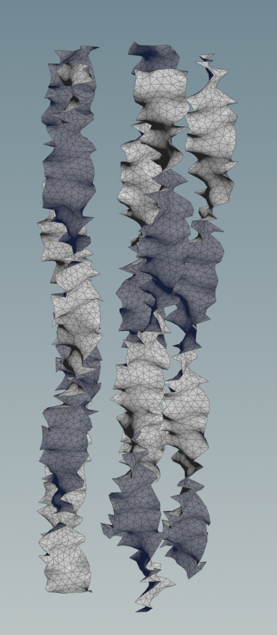

# Procedural Jellyfish Showcase

https://github.com/user-attachments/assets/1f7c753d-3a7b-4af0-9c1e-1a8177017938

# Description

This is my first rendered Houdini project! I’m still figuring out the best way to balance simulation time with development time—I spent quite a while waiting for simulations to finish. However, it was really satisfying to follow the tutorials and finally create a somewhat complete jellyfish.

Hair simulation was added to the tentacles, and cloth simulation was used on the arms to replicate the jellyfish’s movement in the ocean.

## Bell and Arms
To create the wave effect at the edge, I grouped the points along the boundary and applied a Soft Deformation operation to them. The arm follows the steps given in the tutorial. When I tried to extend its length, I found that the elasticity would somehow increase if I scaled it along the Y-axis using a Transform node, compared to adjusting the length directly in the Line node’s attributes.

## Veins

To create the veins, I first found the middle ring of the bell and used the Shortest Path node to connect it to the points along the edge. An interesting detail is that we need to keep one static result of the shortest path, since the bell’s deformation would otherwise cause the veins to update dynamically. I achieved this by combining the Time Shift node and the Point Deform node.

## Organs
The organs are created from circles and a PolyWire node, but remember to add a Resample node before the PolyWire.

## Tentacles
The tentacles are identified from the points along the edge. They are simulated using Vellum Hair constraint, and the results are visualized with a PolyWire node.

